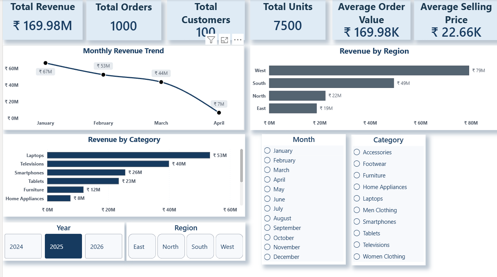
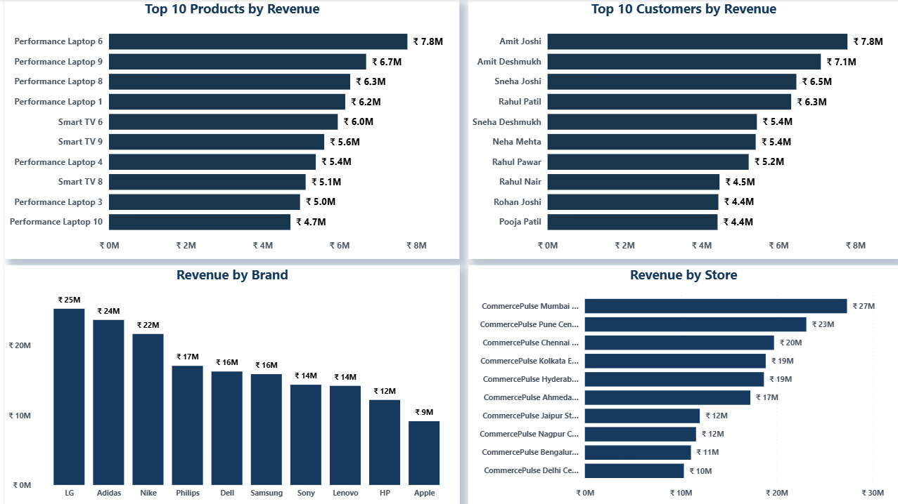

# CommercePulse --- E-Commerce Data Warehouse

A complete **SQL Server + Power BI e-commerce data warehouse project**
designed to demonstrate the end-to-end workflow from OLTP data modeling
to dimensional warehousing, ETL, analytics, performance optimization,
and business intelligence reporting.

## Project Overview

CommercePulse simulates an e-commerce business with customers, products,
stores, orders, order items, and payments.

The project follows a practical Data Engineering workflow:

**OLTP Database → ETL → Dimensional Data Warehouse → Analytical SQL →
Performance Optimization → Power BI**

The focus is on building a structured warehouse that can support
business reporting and analytical workloads.

------------------------------------------------------------------------

## Architecture

``` text
                    ┌─────────────────────┐
                    │     OLTP Database   │
                    │                     │
                    │ Categories           │
                    │ Customers            │
                    │ Products             │
                    │ Stores               │
                    │ Orders               │
                    │ Order Items          │
                    │ Payments             │
                    └──────────┬──────────┘
                               │
                               │ ETL
                               ▼
              ┌────────────────────────────────┐
              │      CommercePulse DW          │
              │                                │
              │ DimCustomer                    │
              │ DimProduct                     │
              │ DimDate                        │
              │ DimStore                       │
              │ DimPaymentMethod               │
              │                                │
              │ FactSales                      │
              │ FactPayment                    │
              └───────────────┬────────────────┘
                              │
                 ┌────────────┴────────────┐
                 ▼                         ▼
        ┌──────────────────┐      ┌──────────────────┐
        │ Analytical SQL   │      │     Power BI     │
        │                  │      │                  │
        │ Revenue          │      │ Executive Sales  │
        │ Rankings         │      │ Product/Customer │
        │ Segmentation     │      │ Analysis         │
        │ Reconciliation   │      │                  │
        └──────────────────┘      └──────────────────┘
```

------------------------------------------------------------------------

## Tech Stack

-   **Database:** Microsoft SQL Server
-   **Query Language:** T-SQL
-   **Data Warehouse:** Star-schema dimensional model
-   **ETL:** T-SQL
-   **BI:** Microsoft Power BI
-   **Data Modeling:** Fact and Dimension tables
-   **Historical Tracking:** SCD Type 2
-   **Performance:** SQL Server indexes and execution-plan analysis
-   **Version Control:** Git / GitHub

------------------------------------------------------------------------

## Data Model

### Dimension Tables

  Dimension            Purpose
  -------------------- -------------------------------------------------------
  `DimCustomer`        Customer attributes and customer history
  `DimProduct`         Product, category, subcategory, and brand information
  `DimDate`            Calendar attributes used for time-based analysis
  `DimStore`           Store, city, state, country, and region information
  `DimPaymentMethod`   Payment method reference data

### Fact Tables

  -----------------------------------------------------------------------
  Fact                                Purpose
  ----------------------------------- -----------------------------------
  `FactSales`                         Sales transactions, quantities,
                                      prices, discounts, and revenue

  `FactPayment`                       Payment transactions used for
                                      payment analysis and reconciliation
  -----------------------------------------------------------------------

The warehouse uses a **star-schema approach**, with fact tables
connected to descriptive dimensions.

------------------------------------------------------------------------

## ETL Pipeline

The ETL layer loads data from the OLTP model into the warehouse.

### Customer Loading

The customer dimension includes an **SCD Type 2 implementation** so
historical changes can be preserved instead of simply overwriting the
existing customer record.

This allows the warehouse to retain:

-   Previous customer attribute values
-   Current customer attribute values
-   Effective dates
-   End dates
-   Historical versions

### Other Loads

The ETL layer also handles:

-   Product dimension loading
-   Date dimension generation
-   Store dimension loading
-   Payment method loading
-   Sales fact loading
-   Payment fact loading

------------------------------------------------------------------------

## Analytics

The project contains analytical SQL scripts covering:

1.  Payment reconciliation
2.  Monthly revenue
3.  Top products by revenue
4.  Top customers by revenue
5.  Regional revenue
6.  Category performance
7.  Monthly revenue ranking
8.  Running revenue
9.  Product rankings
10. Customer segmentation
11. Store performance
12. Revenue contribution

These queries demonstrate practical SQL techniques including:

-   Aggregations
-   `GROUP BY`
-   `HAVING`
-   Joins
-   CTEs
-   Window functions
-   Ranking
-   Running totals
-   Percentage contribution
-   Customer segmentation
-   Time-based analysis

------------------------------------------------------------------------

## Performance Optimization

The project includes a dedicated performance section covering:

-   Baseline query performance
-   Index creation
-   Index seek testing
-   Covering indexes
-   Before/after performance comparison

The goal is to demonstrate that SQL development is not only about
obtaining the correct result, but also about understanding how queries
behave and how indexing can improve execution.

------------------------------------------------------------------------

# Power BI Dashboard

The Power BI report contains two main pages.

## 1. Executive Sales Overview

The executive dashboard provides a high-level view of sales performance.

### KPIs

-   Total Revenue
-   Total Orders
-   Total Customers
-   Total Units
-   Average Order Value
-   Average Selling Price

### Visualizations

-   Monthly Revenue Trend
-   Revenue by Region
-   Revenue by Category

### Interactive Filters

-   Year
-   Month
-   Region
-   Category

The slicers are synchronized across the report pages so users can
analyze the same selected period, region, and category across different
views.

### Dashboard Preview



------------------------------------------------------------------------

## 2. Product & Customer Analysis

The second page focuses on product, customer, brand, and store
performance.

### Visualizations

-   Top 10 Products by Revenue
-   Top 10 Customers by Revenue
-   Revenue by Brand
-   Revenue by Store

These visuals allow users to identify high-value products, customers,
brands, and stores.

### Dashboard Preview



------------------------------------------------------------------------

## Key Business Insights

Based on the current Power BI dashboard:

-   Total revenue is approximately **₹169.98M**.
-   The dataset contains **1,000 orders** and **100 customers**.
-   Total units sold are **7,500**.
-   The **West region** contributes the highest revenue at approximately
    **₹79M**.
-   **Laptops** are the strongest revenue-generating category at
    approximately **₹53M**.
-   **LG** is the leading brand in the displayed overall analysis at
    approximately **₹25M**.
-   The executive dashboard shows revenue declining from January through
    April in the available 2025 data.
-   The product/customer analysis identifies the highest-revenue
    products and customers for deeper investigation.

> These insights describe the current sample dataset and should not be
> interpreted as real-world market statistics.

------------------------------------------------------------------------

## Project Structure

``` text
CommercePulse — E-Commerce Data Warehouse/
│
├── CommercePulse — E-Commerce Data Warehouse.slnx
│
├── data/
│
├── docs/
│
├── powerbi/
│   └── CommercePulse.pbix
│
├── screenshots/
│   ├── page-1.png
│   └── page-2.png
│
├── sql/
│   ├── 01_oltp/
│   ├── 02_sample_data/
│   ├── 03_warehouse/
│   ├── 04_etl/
│   ├── 05_analytics/
│   └── 06_performance/
│
└── tests/
```

------------------------------------------------------------------------

## SQL Folder Structure

``` text
sql/
│
├── 01_oltp/
│   ├── 01_create_database.sql
│   ├── 02_create_categories.sql
│   ├── 03_create_customers.sql
│   ├── 04_create_products.sql
│   ├── 05_create_stores.sql
│   ├── 06_create_orders.sql
│   ├── 07_create_order_items.sql
│   └── 08_create_payments.sql
│
├── 02_sample_data/
│
├── 03_warehouse/
│
├── 04_etl/
│
├── 05_analytics/
│
└── 06_performance/
```

------------------------------------------------------------------------

## How to Run

### 1. Create the OLTP database

Run the scripts under:

``` text
sql/01_oltp/
```

in the intended sequence.

### 2. Load sample data

Run:

``` text
sql/02_sample_data/
```

### 3. Create the warehouse

Run:

``` text
sql/03_warehouse/
```

### 4. Execute ETL

Run the scripts under:

``` text
sql/04_etl/
```

in sequence.

### 5. Run analytical queries

Use:

``` text
sql/05_analytics/
```

to reproduce the analytical outputs.

### 6. Test performance

Use:

``` text
sql/06_performance/
```

to compare query behavior before and after indexing.

### 7. Open Power BI

Open:

``` text
powerbi/CommercePulse.pbix
```

and refresh the model if the SQL Server connection is configured for the
target environment.

------------------------------------------------------------------------

## Important Implementation Notes

-   The project uses **T-SQL / SQL Server**.
-   The warehouse separates transactional processing from analytical
    reporting.
-   `FactSales` is the primary sales fact table used by the Power BI
    report.
-   `DimDate`, `DimProduct`, `DimCustomer`, and `DimStore` provide
    analytical dimensions.
-   Customer history is handled through **SCD Type 2**.
-   Power BI measures are used for core KPIs rather than relying only on
    implicit aggregations.
-   Currency formatting is configured for **₹ Indian Rupees** in the
    report.
-   Year, Month, Region, and Category slicers are used for interactive
    analysis.

------------------------------------------------------------------------

## What This Project Demonstrates

This project demonstrates practical understanding of:

**SQL Development** - Database creation - Relational modeling -
Constraints and keys - Joins - Aggregations - CTEs - Window functions

**Data Warehousing** - Star schema - Fact tables - Dimension tables -
Surrogate/business keys - Date dimension - SCD Type 2

**ETL** - Initial dimension loads - Historical dimension updates - Fact
loading - Data transformation

**Analytics** - Revenue analysis - Ranking - Segmentation - Running
totals - Contribution analysis - Reconciliation

**Performance Engineering** - Indexing - Index seeks - Covering
indexes - Query performance comparison

**Business Intelligence** - Power BI data modeling - DAX measures - KPI
cards - Interactive slicers - Drill/filter behavior - Executive
reporting

------------------------------------------------------------------------

## Future Improvements

Possible extensions include:

-   Automating ETL with an orchestration tool such as Airflow
-   Incremental fact loading
-   Data quality validation framework
-   Automated testing
-   Cloud warehouse deployment
-   CI/CD for SQL and Power BI artifacts
-   More advanced customer segmentation
-   Forecasting and anomaly detection
-   Row-level security
-   Incremental Power BI refresh

------------------------------------------------------------------------

## Author

**Ayush Kale**

Built as a portfolio Data Engineering project demonstrating an
end-to-end e-commerce analytics workflow using SQL Server and Power BI.
